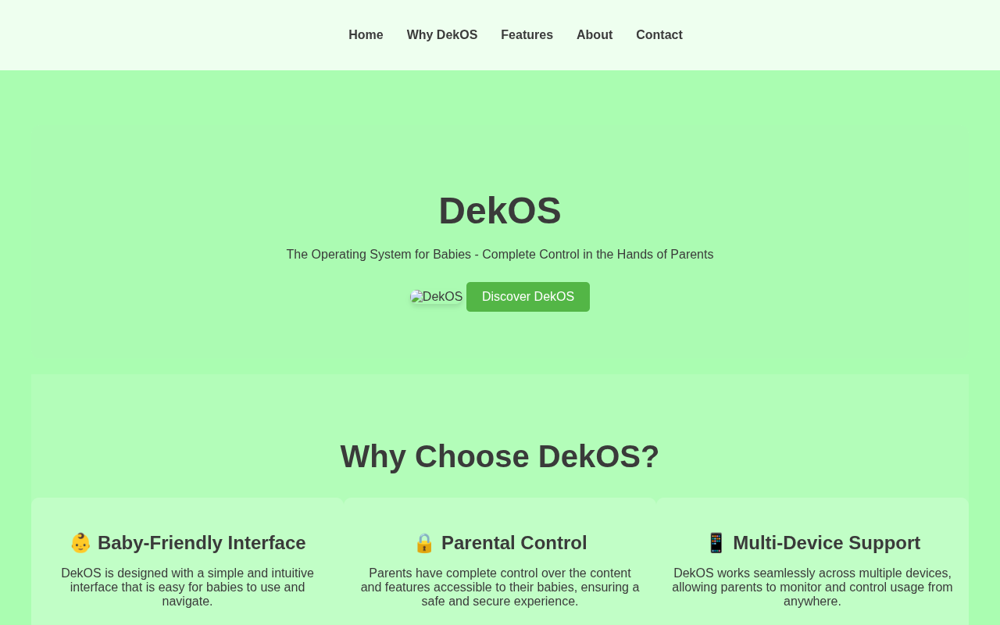

# DekOS — The Operating System for Babies

A parody product landing page — features, a "blog", about, and contact for an operating system for babies. The published page is `dekos.html` (there is no `index.html` at the repo root).

**Live:** https://mvvk-space.github.io/dekos/dekos.html

